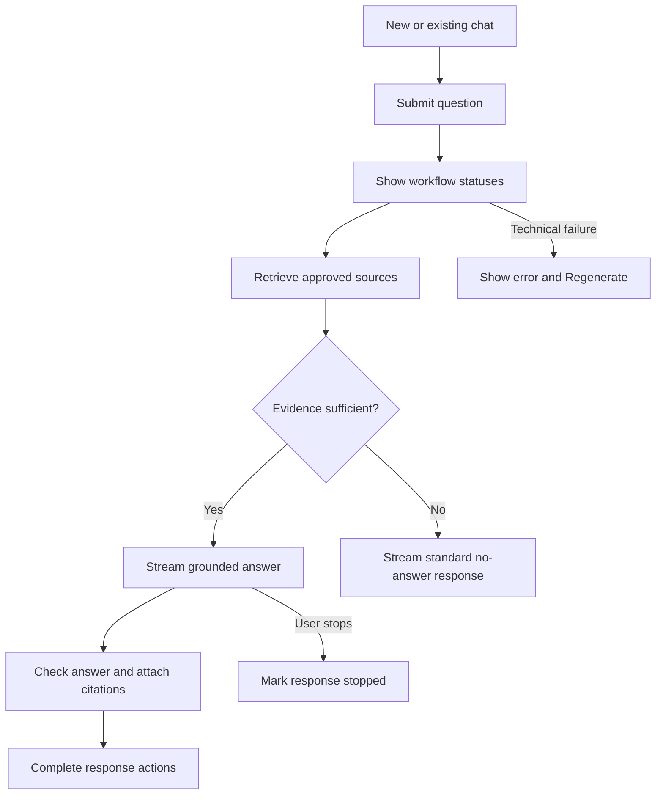
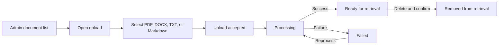

# TaskFlow RAG Assistant UI Wireframes

- **Document ID:** TF-P1-UI-001
- **Version:** 1.0
- **Last updated:** 2026-08-05
- **Status:** Phase 1 low-fidelity specification

These wireframes define the future MVP interface for TaskFlow, a fictional demonstration SaaS product. They describe layout and behavior only; they are not frontend code. The visual identity must be original and must not use ChatGPT branding, logos, or an exact copy of its interface.

## Shared Interface Principles

- Keep chat controls predictable, compact, and keyboard accessible.
- Keep the message composer visible at the bottom of the conversation viewport.
- Display citations beside the claims they support and make each citation openable.
- Show operational progress only through the five approved Thinking statuses.
- Preserve a user's conversation history without exposing another user's history.
- Show document administration only to the assistant-level Admin role.
- Use clear focus order, visible labels, sufficient contrast, and touch targets that remain usable on mobile.

## 1. Login Page

**Purpose:** Authenticate a User or Admin with an email address and password before showing protected features.

```text
+------------------------------------------------------+
| TaskFlow RAG Assistant                               |
| Fictional demonstration product                      |
|                                                      |
|              +------------------------+              |
|              | Sign in                |              |
|              | Email                  |              |
|              | [____________________] |              |
|              | Password               |              |
|              | [____________________] |              |
|              | [ Sign in ]            |              |
|              +------------------------+              |
+------------------------------------------------------+
```

- **Main components:** Product name, fictional-product label, email field, password field, validation area, and Sign in button.
- **Primary actions:** Enter credentials and sign in.
- **Empty state:** Both fields are blank; Sign in remains unavailable until required values are present.
- **Loading state:** Disable the form and show an inline signing-in indicator without changing the layout.
- **Error state:** Show a concise authentication error near the form without revealing which credential was incorrect or exposing provider details.
- **Responsive behavior:** Use one centered, full-width-constrained form. On small screens, reduce outer margins while keeping fields and the action at comfortable touch height.

## 2. Main Chat Page

**Purpose:** Provide the primary authenticated workspace for asking TaskFlow support questions and reviewing grounded answers.

```text
+----------------------+-----------------------------------------------+
| TaskFlow Assistant   | TaskFlow support                      [User]  |
| [+ New Chat]         +-----------------------------------------------+
|                      | User                                          |
| Conversations        | Which plans include API access?               |
| > API access         |                                               |
|   Annual billing     | Assistant                                     |
|   Refund policy      | API access is available on Pro and Business.  |
|                      | [1] Integrations and Troubleshooting           |
| [Documents - Admin]  |                                               |
|                      | [Thinking v] [Copy] [Helpful] [Not helpful]   |
|                      | [Regenerate]                                  |
|                      |                                               |
|                      +-----------------------------------------------+
|                      | [ Ask about TaskFlow...              ] [Send] |
+----------------------+-----------------------------------------------+
```

- **Main components:** Left conversation sidebar, New Chat action, optional Admin Documents navigation, conversation transcript, user and assistant messages, citation cards, collapsed Thinking panel, response actions, and sticky composer.
- **Primary actions:** Start a chat, select history, submit a question, open a citation, expand Thinking, copy or regenerate a response, and provide positive or negative feedback.
- **Empty state:** Use the dedicated empty chat state in Screen 3.
- **Loading state:** Keep the current transcript visible while conversation history or a selected conversation loads; use stable placeholders that do not shift the composer.
- **Error state:** Preserve the submitted question, mark incomplete output clearly, show a concise error, and offer Regenerate without fabricated text or citations.
- **Responsive behavior:** Keep the sidebar visible on desktop. Collapse it into a modal drawer below the desktop breakpoint; allow the transcript to use the remaining width and keep the composer sticky.

## 3. Empty Chat State

**Purpose:** Help a User begin a new grounded conversation without presenting marketing content.

```text
+---------------------------------------------------------------+
|                     TaskFlow support                          |
|                                                               |
|              What can we help you find?                       |
|                                                               |
| [Compare TaskFlow plans]  [Which plans include API access?]   |
| [Explain annual billing]  [What happens after cancellation?]  |
|                                                               |
| [ Ask about TaskFlow...                              ] [Send]  |
+---------------------------------------------------------------+
```

- **Main components:** Compact heading, approved suggested questions, and sticky message composer.
- **Primary actions:** Select a suggested question or enter and submit a custom TaskFlow question.
- **Empty state:** This screen is the empty state; it contains no placeholder messages or fake conversation.
- **Loading state:** If suggestions are loading, keep the composer available and reserve fixed space for suggestion placeholders.
- **Error state:** If suggestions fail, omit them and keep the composer functional; do not block the User from asking a question.
- **Responsive behavior:** Wrap suggestions into fewer columns and then a single column. Keep text within each button and keep the composer above the mobile safe area.

## 4. Streaming Answer State

**Purpose:** Let the User read answer text as it arrives and stop generation when needed.

```text
+---------------------------------------------------------------+
| User: What is included on Pro?                                |
|                                                               |
| [Thinking v] Preparing a cited response                       |
|                                                               |
| Assistant                                                     |
| Pro costs $24 per user per month and includes custom fields,  |
| API access, Slack, Google Drive...|                            |
|                                                               |
|                    [ Stop Generation ]                        |
|                                                               |
| [ Ask a follow-up...                                 ]        |
+---------------------------------------------------------------+
```

- **Main components:** Submitted question, live Thinking status, growing assistant response, streaming indicator, Stop Generation action, and temporarily inactive send control.
- **Primary actions:** Stop generation or expand/collapse the Thinking panel.
- **Empty state:** Before the first text token, show the current approved status and reserve the response region; do not display invented placeholder content.
- **Loading state:** Append answer text incrementally without moving the transcript controls. Citations and completed-response actions appear only after verification.
- **Error state:** Stop the stream, label partial text as incomplete, retain the question, show a concise error, and offer Regenerate.
- **Responsive behavior:** Keep Stop Generation close to the composer on small screens. Long answer text wraps naturally without horizontal scrolling.

## 5. Expanded Thinking-Status Panel

**Purpose:** Show workflow progress without revealing internal prompts, hidden reasoning, or private chain-of-thought.

```text
+---------------------------------------------------------------+
| Thinking                                                [^]   |
| [done] Understanding your question                            |
| [done] Searching the knowledge base                           |
| [done] Reviewing relevant sources                             |
| [now ] Preparing a cited response                             |
| [wait] Checking the answer                                    |
+---------------------------------------------------------------+
```

- **Main components:** Collapse control and the five approved status labels with pending, current, or complete visual states.
- **Primary actions:** Expand or collapse the panel.
- **Empty state:** Before processing begins, keep the panel collapsed and show no speculative statuses.
- **Loading state:** Advance the current indicator as workflow status events arrive; never display generated explanations of what the model is thinking.
- **Error state:** Stop status progression and show the request error outside the panel. Preserve completed statuses only as workflow history.
- **Responsive behavior:** Fill the available message width on desktop and mobile. Status labels wrap rather than truncate, and expansion must not cover the composer.

The labels are workflow statuses only. They are not the model's private chain-of-thought.

## 6. Source Citation Drawer

**Purpose:** Let the User verify the approved source document and section used for an answer.

```text
+----------------------------------+----------------------------+
| Conversation                     | Source                 [X] |
|                                  | Plans and Billing          |
| Pro includes API access. [1]     | Section: Pro Plan          |
|                                  | ID: TF-KB-PLANS-BILLING-001|
|                                  | Version: 1.0               |
|                                  | Status: Approved           |
|                                  | Updated: 2026-08-06        |
|                                  | -------------------------  |
|                                  | Cited content excerpt...   |
+----------------------------------+----------------------------+
```

- **Main components:** Drawer title, close action, document title, section title, document ID, version, approval status, last-updated date, and cited content.
- **Primary actions:** Read the cited content and close the drawer.
- **Empty state:** No drawer is shown until a citation is activated.
- **Loading state:** Reserve the drawer dimensions and show metadata/content placeholders while the cited source loads.
- **Error state:** State that the source cannot be opened; keep the citation label visible and do not substitute a different source.
- **Responsive behavior:** Use a right-side drawer on wide screens and a full-width bottom sheet or page-level overlay on mobile. Trap focus while open and return focus to the citation on close.

## 7. Conversation-History Sidebar

**Purpose:** Let a User start a new conversation or reopen the User's own prior conversations.

```text
+--------------------------+
| TaskFlow Assistant       |
| [+ New Chat]             |
|                          |
| Conversations            |
| [API access         ]    |
| [Annual billing     ]    |
| [Refund eligibility]     |
|                          |
| [Documents - Admin]      |
+--------------------------+
```

- **Main components:** Product label, New Chat action, scrollable conversation list, current-conversation state, and Admin Documents link for Admins only.
- **Primary actions:** Start a new chat, open an existing conversation, or navigate to Documents when authorized.
- **Empty state:** Show `No conversations yet` with New Chat remaining prominent.
- **Loading state:** Show fixed-height list placeholders while keeping New Chat usable.
- **Error state:** Show a retryable history-loading error without removing the active conversation from the main area.
- **Responsive behavior:** Remain fixed at the left on desktop. On mobile, open as a dismissible drawer from the header menu; closing it returns focus to the menu control.

Renaming, deleting, sharing, or searching conversations is not defined in the MVP scope and is intentionally absent.

## 8. Admin Documents Page

**Purpose:** Let an authorized Knowledge Administrator inspect and manage approved source documents.

```text
+---------------------------------------------------------------------+
| TaskFlow Assistant / Documents                         [Upload]      |
+---------------------------------------------------------------------+
| Title                     | ID               | Ver | Status | Actions|
| Plans and Billing         | TF-KB-...-001    | 1.0 | Ready  | [Del]  |
| Account and Security      | TF-KB-...-001    | 1.0 | Ready  | [Del]  |
| Integration Update        | TF-KB-...-002    | 1.1 | Failed | [Redo] |
+---------------------------------------------------------------------+
```

- **Main components:** Page heading, Upload action, document list, identifying metadata, processing status, Delete action, and Reprocess action when applicable.
- **Primary actions:** Open Upload, inspect status, delete with confirmation, and reprocess a document.
- **Empty state:** Show `No source documents` and an Upload action. Do not imply that answers are available without approved sources.
- **Loading state:** Preserve table columns and show row placeholders while documents load.
- **Error state:** Show a list-loading error with Retry. A failed document row retains its identity and offers Reprocess.
- **Responsive behavior:** Convert table rows into stacked records on narrow screens, keeping status and actions visible without horizontal scrolling.

`Ready`, `Processing`, and `Failed` are proposed assistant processing labels for the wireframes, not TaskFlow product facts.

## 9. Document-Upload Modal

**Purpose:** Allow an Admin to submit one supported knowledge-source file for processing.

```text
+--------------------------------------------------+
| Upload source document                       [X] |
|                                                  |
| Supported: PDF, DOCX, TXT, Markdown              |
| +----------------------------------------------+ |
| | Select a file                                | |
| +----------------------------------------------+ |
| Selected: plans-and-billing.md                   |
|                                                  |
|                         [Cancel] [Upload]         |
+--------------------------------------------------+
```

- **Main components:** Modal title, close action, supported-format text, file picker, selected-file summary, Cancel, and Upload.
- **Primary actions:** Select a file, cancel, or upload the selected source.
- **Empty state:** No file is selected and Upload is unavailable.
- **Loading state:** Disable file selection and actions while uploading; show stable inline progress without claiming processing is complete.
- **Error state:** Identify unsupported format, failed upload, or invalid required document metadata. Keep the modal open so the Admin can choose another file or retry.
- **Responsive behavior:** Use a centered modal on desktop and a full-height sheet on small screens. Keep actions visible above the mobile safe area.

No upload-size limit is shown because the knowledge-source upload limit is not defined. The TaskFlow customer attachment limit does not apply to this assistant admin workflow.

## 10. Document-Processing State

**Purpose:** Show that an uploaded document is not available for retrieval until processing succeeds.

```text
+---------------------------------------------------------------------+
| Title: policy-update.docx                                           |
| Status: Processing                                                  |
|                                                                     |
| [done] Upload received                                              |
| [now ] Processing document                                         |
| [wait] Available for retrieval                                      |
|                                                                     |
| Actions are unavailable while processing.                           |
+---------------------------------------------------------------------+
```

- **Main components:** Document identity, current status, high-level processing steps, and contextual action area.
- **Primary actions:** Wait while processing; after failure, select Reprocess; after completion, return to the document list or delete the document.
- **Empty state:** If no document is selected, return to the Admin Documents empty or list state rather than showing a blank processor.
- **Loading state:** Use an indeterminate indicator; no numeric percentage or completion time is promised.
- **Error state:** Mark the document Failed, show a concise operational error without raw parser traces, and offer Reprocess.
- **Responsive behavior:** Use a single-column status layout at all widths. Keep the document name wrapping safely and the recovery action reachable.

The processing steps are operational labels, not private reasoning. Failed, processing, or deleted documents must not be used for retrieval.

## 11. Mobile Chat Layout

**Purpose:** Preserve the complete chat workflow on a narrow viewport without overlapping navigation, content, or composer controls.

```text
+--------------------------------+
| [Menu] TaskFlow        [New]   |
+--------------------------------+
| User                           |
| Does Pro include API access?   |
|                                |
| [Thinking v]                   |
| Assistant                      |
| Yes. API access is available   |
| on Pro and Business. [1]       |
|                                |
| [Copy] [Helpful] [Not helpful] |
| [Regenerate]                   |
|                                |
|                                |
+--------------------------------+
| [ Ask a follow-up...     ][>]  |
+--------------------------------+
```

- **Main components:** Header menu, New Chat action, single-column transcript, Thinking panel, citation cards, response actions, and bottom sticky composer.
- **Primary actions:** Open the history drawer, start a new chat, send or stop a message, expand Thinking, open citations, copy, regenerate, and submit feedback.
- **Empty state:** Use the compact suggested questions from Screen 3 above the sticky composer.
- **Loading state:** Stream text within the fixed-width conversation column and replace Send with Stop Generation while active.
- **Error state:** Place the concise error below the affected message, retain the question, and provide Regenerate without covering the composer.
- **Responsive behavior:** The sidebar becomes a modal drawer, citation content becomes a bottom sheet or overlay, response controls wrap to multiple rows, and the composer remains above the keyboard and safe area.

## Chat Interaction Flow



## Document Administration Flow


