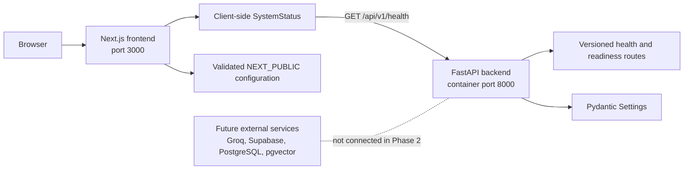

# TaskFlow Phase 2 Architecture Foundation

- **Document ID:** TF-P2-ARCHITECTURE-001
- **Version:** 1.0
- **Last updated:** 2026-08-05
- **Status:** Phase 2 foundation documentation

TaskFlow RAG Assistant is a portfolio application for TaskFlow, a fictional demonstration SaaS
product. Phase 2 provides a frontend, an API, typed configuration, development tooling, and service
health checks. It does not provide the planned assistant workflow.

## Architecture Summary

The frontend and backend are independent applications joined by one small HTTP contract. The
browser renders the Next.js foundation screen and, after the status component mounts, requests the
FastAPI health endpoint. FastAPI validates its own configuration and returns a typed, public health
response. Neither application needs an external service to start or pass its Phase 2 checks.



## Frontend Responsibilities

The `frontend/` application is responsible for:

- Rendering the responsive Phase 2 project-foundation screen with the Next.js App Router.
- Showing TaskFlow as a fictional demonstration product and describing the current scope honestly.
- Running `SystemStatus` only in the browser after mount, never during static generation.
- Reading and validating browser-safe configuration through Zod.
- Calling `GET /api/v1/health`, validating the JSON contract, and showing checking, connected, or
  unavailable status text.
- Aborting a health request on unmount or after the bounded timeout.
- Providing ESLint, strict TypeScript, Vitest, React Testing Library, and production-build checks.

The frontend does not implement chat, authentication, document management, retrieval, generation,
citations, or streaming in Phase 2.

## Backend Responsibilities

The `backend/` application is responsible for:

- Creating the FastAPI application from typed Pydantic Settings values.
- Allowing CORS requests only from the configured frontend origin.
- Providing public metadata at `GET /`.
- Providing deterministic liveness at `GET /api/v1/health`.
- Providing foundation-only readiness at `GET /api/v1/readiness`.
- Returning explicit Pydantic response models without configuration secrets.
- Starting and reporting ready without Groq, Supabase, PostgreSQL, or another external service.
- Providing pytest, Ruff, mypy, and locked uv dependency workflows.

The readiness endpoint intentionally checks only the API process. It must not imply that a database,
retrieval pipeline, model provider, or authentication system is available.

## Frontend-to-Backend Communication

1. `SystemStatus` mounts in the browser and creates an `AbortController`.
2. `getBackendHealth` reads `NEXT_PUBLIC_API_BASE_URL` through the validated public configuration.
3. The browser sends `GET {base URL}/api/v1/health` with an `Accept: application/json` header and
   caching disabled.
4. FastAPI returns the typed service status, version, and application environment.
5. Zod validates the response before the component reports `API connected`.
6. A network error, non-success HTTP status, timeout, or invalid response reports `API unavailable`.

The backend is not contacted while Next.js performs static build generation, so an offline backend
does not block `npm run build`.

## Configuration Boundaries

Configuration is split by execution boundary. A `NEXT_PUBLIC_` prefix means Next.js can include the
value in browser JavaScript; it is not a security boundary for secrets.

| Boundary | Current variables | Rules |
| --- | --- | --- |
| Browser-visible frontend | `NEXT_PUBLIC_API_BASE_URL` | May contain only a public URL. It is validated by Zod. |
| Reserved browser-visible frontend | `NEXT_PUBLIC_SUPABASE_URL`, `NEXT_PUBLIC_SUPABASE_PUBLISHABLE_KEY` | Empty in Phase 2. A publishable key is not a server secret, but it is not configured until authentication work is authorized. |
| Backend runtime, non-secret | `APP_NAME`, `APP_ENVIRONMENT`, `APP_VERSION`, `API_V1_PREFIX`, `FRONTEND_ORIGIN`, `LOG_LEVEL` | Read by Pydantic Settings. Unknown variables are ignored. |
| Backend runtime, secret or service-specific | `GROQ_API_KEY`, `GROQ_MODEL`, `SUPABASE_URL`, `SUPABASE_PUBLISHABLE_KEY`, `SUPABASE_SECRET_KEY`, `DATABASE_URL` | Optional and empty in Phase 2. Secret values use masked types and must never enter frontend code, logs, errors, or API responses. |

`frontend/.env.example` and `backend/.env.example` contain placeholders only. Real `.env` and
`.env.local` files are ignored and must never be committed. In particular, `GROQ_API_KEY`,
`SUPABASE_SECRET_KEY`, and `DATABASE_URL` are always server-only.

## Current Folder Structure

```text
.
├── backend/
│   ├── app/
│   │   ├── api/
│   │   │   ├── router.py
│   │   │   └── routes/health.py
│   │   ├── core/config.py
│   │   ├── schemas/health.py
│   │   └── main.py
│   ├── tests/
│   ├── Dockerfile
│   ├── pyproject.toml
│   └── uv.lock
├── frontend/
│   ├── src/
│   │   ├── app/
│   │   ├── components/system-status.tsx
│   │   ├── lib/
│   │   └── tests/
│   ├── Dockerfile
│   ├── package.json
│   └── package-lock.json
├── docs/
│   ├── phase-1/
│   └── phase-2/
├── sample-data/
│   ├── evaluation/
│   └── knowledge-base/
├── scripts/
│   ├── validate_phase_1.py
│   └── validate_phase_2.py
├── compose.yaml
├── package.json
└── package-lock.json
```

Phase 1 documents and sample data remain preserved. Root npm scripts orchestrate the two application
toolchains; they do not merge their dependencies or runtime boundaries.

## Reserved Future Locations

The following paths are architectural reservations, not existing implementations. They may be
created only in the authorized later phase and may be refined before implementation.

| Future concern | Proposed location | Intended boundary |
| --- | --- | --- |
| RAG orchestration and retrieval | `backend/app/rag/` | LangChain/LangGraph workflow, retrieval interfaces, grounding, and citation assembly. |
| Database access | `backend/app/db/` | Server-only Supabase/PostgreSQL clients, repositories, and transaction boundaries. |
| Database migrations | `supabase/migrations/` | Versioned schema changes after database work is authorized. No migration exists in Phase 2. |
| Backend authentication | `backend/app/auth/` and later protected API routes | Token verification and authorization dependencies without leaking server credentials. |
| Frontend authentication | `frontend/src/app/(auth)/` and `frontend/src/lib/auth/` | Sign-in UI and browser-safe session integration after the authentication phase begins. |
| Future assistant UI | Later routes and components under `frontend/src/` | Chat, citations, history, and admin experiences only when their implementation phase is approved. |

## External-Service Status

**External services are not connected yet.** Phase 2 does not install or call Groq, Supabase,
PostgreSQL, pgvector, LangChain, or LangGraph. It does not create tables, migrations, embeddings,
documents, users, sessions, or model responses. Optional future-service settings are inactive
configuration seams and do not represent working integrations.
